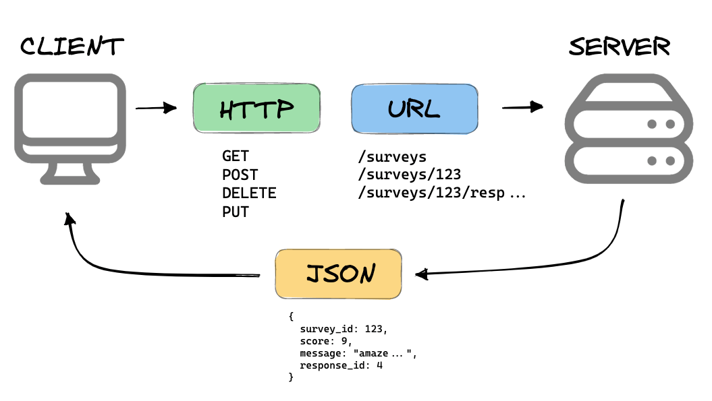
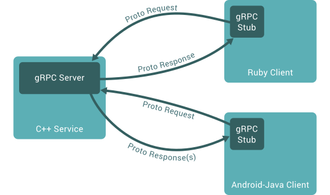

tags: #systems #architecture #research

# Event Driven and Synchronous Systems

## Abstract

## Goal

The goal of this paper is to provide information about
Synchronous and Event-Driven systems in conceptual and architectural perspective.

## Introduction

This paper would explain about synchronous and event driven systems by taking into account how service interaction takes place in microservices architecture.

## Synchronous Systems

A synchronous system refers to a system in which various operations, such as communication, data processing, data transfer, or process execution, happen in a blocking or waiting manner. In other words, the system operates in a synchronised and coordinated fashion, where each operation blocks or pauses the execution until it finishes.

An analogy could be a phone call where each party has to wait for other to finish responding.

In microservice architecture where services are communicating through REST API using HTTP calls, client service has to wait for the response from the server and execution moves forwards once the response comes back.

Let's see some of the synchronous communication implementations in microservices.

### Implementations

1. REST APIs
2. RPC
3. GraphQL

#### REST APIs

These are the interfaces provided by services or applications where other services can send requests to. It is the conventional and easy method for inter-service communication.

Each of the service has its own web server up and running on some port. These services provide endpoints where other services can send requests.

Considering the example of an E-commerce website, client sends the request to get all products data from the server. Client has to wait for the response from the server and then only client can show all the products. It makes this method of communication synchronous as there is a blocking of execution.

#### Remote Procedure Call

REST APIs are the way to access services provided by the server by using request/response mechanism. This method can be used for inter-service communication. However, using REST APIs as solely method of communication has its own limitations. Some of them are described below.

1. No defined request/response schema.
2. Communication payload can be bulky.

Following diagram shows how services interact using RPC mechanism.

Figure shows that client and server are interacting using gRPC (Google RPC implementation). When the client sends request to server, client has to wait for the response. Until then client has to block its execution for that request.

Let's see one more way where services interact synchronously.

#### GraphQL

This is a data query and manipulation language. It gets the request from the clients as a form of a query, it parses and resolves the query and send back the response.

Unlike REST APIs, the query has defined schema about what all attributes to send in response. It makes the payload less bulky and only contains the required information.

**GraphQL is a specification** and it can be implemented in different languages such as Javascript, Java, C, C++, Python, etc.

Mostly communication is done synchronously using request/response model. However, it provides a mechanism of **Subscription** where clients can get real time updates asynchronously.

So, these were some of the implementations of synchronous communication. Some of them are evolving to provide asynchronous functionality which makes the interaction much effective and performative.

Now, let's examine some of the drawbacks of synchronous communication.

### Drawbacks of Synchronous communication

1. **Autonomous micro services.**

When there is a complex network of HTTP request/response among micro services, it makes those services less autonomous.

2. **System Resilience**

It is the ability of a service to provide responses to the client requests even in the face of adversity.
When micro services have dense network of HTTP request/response and if any service fails, the dependent services may not provide favourable outcomes.

3. **Slow system**

One microservice has to wait for downstream service for the response. This makes the overall request/response process slow. It becomes worse if there is a chain of those requests.

## Event Driven System

Event driven systems, are systems that uses events to trigger and communicate between decoupled services where an **event** is change in state. For instance, suppose there is a system that has two microservices, A and B, with A allowing users to configure a car and B storing that data in a database. If the user modifies configuration details in service A, it will trigger an event and tell service B about the change in the configuration of the car. Then service B fetches new data from service A and updates the database through event broker.

An event broker is a system that acts as an intermediary between event producer and consumer, it receives event from producer and transmits them to consumer.

Event-driven system typically consists of

- Event producer (agents)
- Event consumers (sinks)
- Event channels.

In the above example, service A is an event producer, and service B is an event consumer. **Event channel** refer to the pathway through which events flow it may be a queue or an event grid.

Event-driven systems communicate asynchronously and use the following protocols for communication :

- Websocket
- Message Queue Telemetry Transport (MQTT)
- Advanced Message Queuing Protocol (AMQP)
- Simple Text Oriented Messaging Protocol (STOMP)

#### Websocket 

The WebSocket protocol allows for constant, bi-directional communication between the server and client, which means both parties can communicate and exchange data as and when needed.

WebSockets don’t use a request/response strategy where a connection is opened in the course of making the request and then closed after it's initially fulfilled. In the case of WebSockets, the connection remains open until closed explicitly.

Example :
YouTube's live streaming feature uses WebSockets to enable realtime chat between viewers and the streamer. Similarly, YouTube's notification system uses WebSockets to push realtime updates to users, such as when a new video is uploaded or when someone they follow goes live.

### Benefits of EDA

- Loose coupling

  In above example we have seen that service A is not aware of existence of service B, so making changes to any service will not affect communication between them and services can evolve independently.

* Resilience

  Let say service B is down for some reason, the producer service that is service A can till send message to the queue without interruption. The service B can pick up that message and processes that once it is up and running.

- Performance

  The sender service doesn't need to wait for the response of the receiving service, so it saves time and the sender service can proceed with its other tasks, which improves the system's overall performance.

* System extensibility

  New microservices can be added to the architecture without requiring changes to existing microservices that is service A and B.

- Cut costs

  Event-driven architectures are push-based, so everything happens on-demand as the event presents itself in the router. This way, you’re not paying for continuous polling to check for an event. This means less network bandwidth consumption, less CPU utilization, less idle fleet capacity, and less SSL/TLS handshakes.

## References

1. [IPC in microservices architecture](https://www.diva-portal.org/smash/get/diva2:1451042/FULLTEXT01.pdf)
2. [Patterns for microservices — Sync vs Async](https://medium.com/inspiredbrilliance/patterns-for-microservices-sync-vs-async-5de3be11eb96)
3. [Microservices patterns: synchronous vs asynchronous communication](https://greeeg.com/en/issues/microservices-patterns-synchronous-vs-asynchronous)
4. [Exploring Microservices Communication Patterns](https://levelup.gitconnected.com/synchronous-vs-asynchronous-by-example-36b7b87711e7)[Microservice communication part 1-every programmer must know](https://medium.com/javarevisited/microservices-communication-part-1-every-programmer-must-know-7c6607d2d563)
5. [Do you know about GraphQL](https://medium.com/javarevisited/do-you-know-about-graphql-the-query-language-for-api-s-4038660865be)
